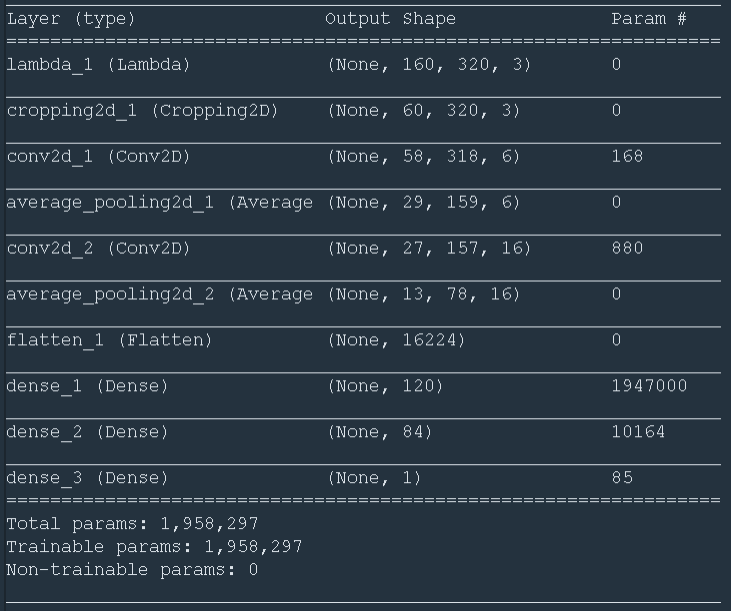
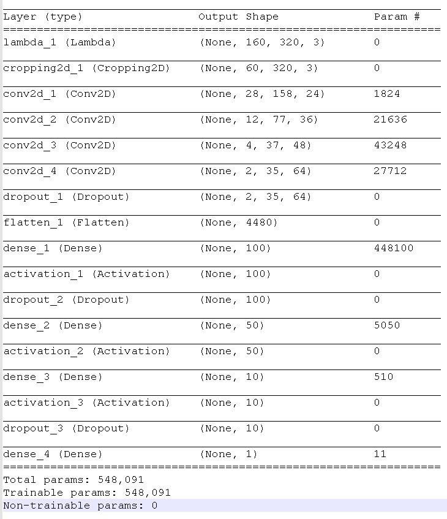

# **Behavioral Cloning** 
---

**Behavioral Cloning Project**

The goals / steps of this project are the following:
* Use the simulator to collect data of good driving behavior
* Build, a convolution neural network in Keras that predicts steering angles from images
* Train and validate the model with a training and validation set
* Test that the model successfully drives around track one without leaving the road
* Summarize the results with a written report


[//]: # (Image References)

[image1]: ./examples/placeholder.png "Model Visualization"
[image2]: ./examples/placeholder.png "Grayscaling"
[image3]: ./examples/placeholder_small.png "Recovery Image"
[image4]: ./examples/placeholder_small.png "Recovery Image"
[image5]: ./examples/placeholder_small.png "Recovery Image"
[image6]: ./examples/placeholder_small.png "Normal Image"
[image7]: ./examples/placeholder_small.png "Flipped Image"

## Rubric Points
### Here I will consider the [rubric points](https://review.udacity.com/#!/rubrics/432/view) individually and describe how I addressed each point in my implementation.  

---
### Files Submitted & Code Quality

#### 1. Submission includes all required files and can be used to run the simulator in autonomous mode

My project includes the following files:

|  Filename   |   Description  | 
|:-------------:|:-------------:|
| model.py | contains data generation, define and train a neural network regression model |
| model.h5 | saved model by keras |
| drive.py | communicate with simulator and use saved model to predict steering angle  |
| run1.mp4 | track 1 video record |
| writeup.md | This is the report file of the project |

#### 2. Submission includes functional code
Using the Udacity provided simulator and my drive.py file, the car can be driven autonomously around the track by executing 
```sh
python drive.py model.h5
```

#### 3. Submission code is usable and readable

The model.py file contains the following tasks:
* load_driving_log() is the function to load 'driving_log.csv' file 
* load_dataset(): is to load images and steering angles.
* load_aug_dataset(): Augmentation of images is done in this function.
* I also write results to pickle files so that I can load them for later use
* First of all, I implemented a LeNet-5 architecture to train quickly and see end to end results on simulator
* Then I implemented Nvidia's architecture with minor changes, as discussed in the class.
* I am not using generator() here but I still have the code in model_generator.py. As the size of the data was not huge so working with out generator() function was sufficient for this project.

So, the model.py file shows the pipeline I used for training and validating the model, and it contains comments to explain how the code works.

### Model Architecture and Training Strategy

#### 1. An appropriate model architecture has been employed

The architecture of CNN is based on [Nvidia's paper](http://images.nvidia.com/content/tegra/automotive/images/2016/solutions/pdf/end-to-end-dl-using-px.pdf). * The architecture used by Nvidia is as below:


My architecture is similar but with some changes that are mentioned below:
* Nvidia's architectur uses input shape of 66x200x3 but I have 160x320x3
* I crop the images and then the dimension becomes 60x320x3
* I drop 5th convolutional layer and add a drop out layer to aviod over-fitting
* I used ELU as activation function
* I used drop outs also after first and 3rd Dense layers

The training uses mean squared error as cost function and Adam optimizer with 0.001 learning rate,
20% data as validation data, 5 epochs and batch size of 32.

#### 2. Attempts to reduce overfitting in the model

The model contains dropout layers in order to reduce overfitting (model.py lines 127, 132, & 139). 

The model was trained and validated on different data sets to ensure that the model was not overfitting. The model was tested by running it through the simulator and ensuring that the vehicle could stay on the track.

#### 3. Model parameter tuning

The model used an adam optimizer, so the learning rate was not tuned manually (model.py line 114). I also tried different values of EPOCHS, DROPOUTS and BATCH_SIZE. In the end, I am using 5 EPOCHS, BATCH_SIZE of 32 and 1 DROPOUT of 0.5 where as other 2 of 0.25, also shown in the architecure

#### 4. Appropriate training data

I used the training data that is provided in the workspace. I have not manually collected data myself for this model. Although, I have ideas to collect data in a smart way by making the car leave the road and come back on the road. Collect data from both tracks and make the car leave at difficult locations and then make it come back on the road to capture a general model that is more robust than my existing model.

### Model Architecture and Training Strategy

#### 1. Solution Design Approach

The overall strategy for deriving a model architecture was to start simple and then keep adding necessary complexity. First of all I used a simple LeNet-5 model and modified its architecture as per need. The architecture was as following:



This resulted in very bad results but I got to know straightaway the I need to improve allot. Therefore, I followed suggestion in lectures about Nvidia's architecture, that I modified as per my needs, as already discussed.

At the end of the process, the vehicle is able to drive autonomously around the track without leaving the road.

#### 2. Final Model Architecture

The final model architecture (model.py lines 118-144) consisted of a convolution neural network with the following layers and layer sizes:



